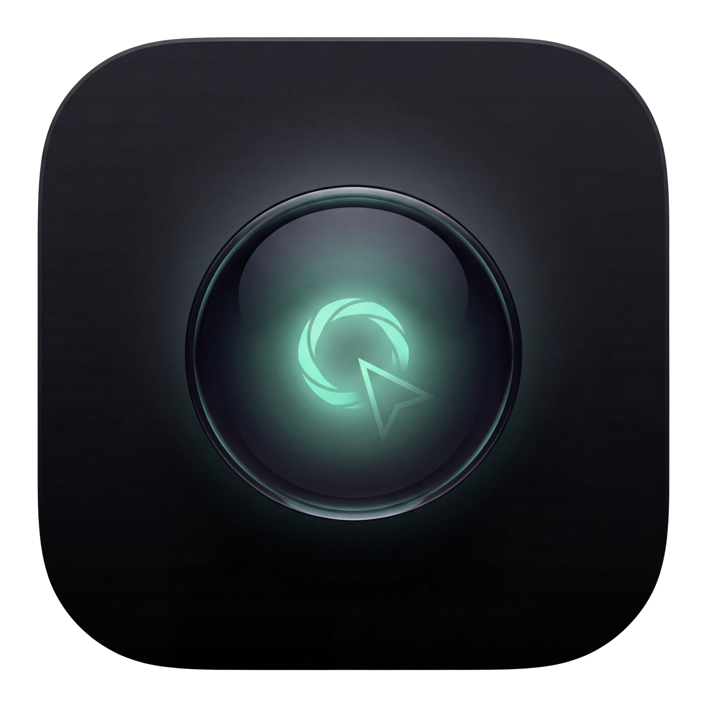

  

<h1 align="center">Scry</h1>

  <strong>Instant search & AI answers in a native floating panel.</strong> 
  Force-click or press Globe, get answers without leaving your app. macOS 13+.

  
  
  

 

macOS Look Up is slow, limited, and mostly useless. Scry replaces it with real search results and AI answers in a native floating panel, without leaving the app you're in.

## 🚀 Get Started

Download the latest DMG from [GitHub Releases](https://github.com/giacomoguidotto/scry/releases).

> Scry is not notarized. On first launch, right-click the app and select **Open** to bypass Gatekeeper. Auto-updates are built in via Sparkle.

On first launch, Scry guides you through two steps:

1. **Disable Look Up** — macOS Look Up conflicts with force-click
2. **Grant Accessibility** — needed to read selected text and detect force-click

## ✨ Features

- **Search from anywhere.** Force-click or press Globe on any selected text to open a floating panel with results.
- **Multiple providers.** Google, DuckDuckGo, and Wikipedia for web searches. Claude, OpenAI, and Ollama (local, free) for AI answers.
- **Screenshot analysis.** AI providers can analyze a screenshot of the area around your cursor.
- **Keyboard-driven.** Switch providers, open links, copy URLs — all without touching the mouse.
- **Native and lightweight.** Pure Swift, no Electron. Sits in your menu bar and stays out of the way.
- **Auto-updates.** Scry checks for updates automatically and installs them in the background.

## ⌨️ Shortcuts

| Action               | Shortcut                   |
| -------------------- | -------------------------- |
| Search selected text | Force-click or `Globe` key |
| Switch provider      | `Cmd+1` – `Cmd+9`         |
| Open in browser      | `Cmd+Return`               |
| Copy URL             | `Cmd+C`                    |
| Close panel          | `Esc`                      |

## 🔍 Under the Hood

Scry is built with Swift and SwiftUI, targeting macOS 13+. The Xcode project is generated with [XcodeGen](https://github.com/yonaskolb/XcodeGen) and linted with [SwiftLint](https://github.com/realm/SwiftLint). Auto-updates are powered by [Sparkle](https://sparkle-project.org).

Free and open source. See [CONTRIBUTING.md](.github/CONTRIBUTING.md) to get involved.
